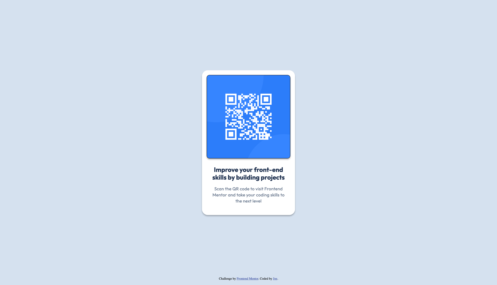

# Frontend Mentor - QR code component solution

This is a solution to the [QR code component challenge on Frontend Mentor](https://www.frontendmentor.io/challenges/qr-code-component-iux_sIO_H). Frontend Mentor challenges help you improve your coding skills by building realistic projects.

## Table of contents

- [Overview](#overview)
  - [Screenshot](#screenshot)
  - [Links](#links)
- [My process](#my-process)
  - [Built with](#built-with)
  - [What I learned](#what-i-learned)
  - [Continued development](#continued-development)
- [Author](#author)

## Overview

### Screenshot

### Links

- Solution URL: [https://github.com/Zugim/qr-code-component/](https://github.com/Zugim/qr-code-component/)
- Live Site URL: [https://qr-code-component-orcin-delta.vercel.app/](https://qr-code-component-orcin-delta.vercel.app/)

## My process

### Built with

- Semantic HTML5 markup
- CSS custom properties

### What I learned

I learned about custom CSS properties (variables) and about semantic HTML elements such as `<main>` and `<footer>`.

### Continued development

I want to continue learning about CSS variables and the best ways to use them efficiently. I also want to learn about more semantic HTML elements and how to make webpages more accessible.

## Author

- Website - [Zugim](https://github.com/Zugim)
- Frontend Mentor - [@Zugim](https://www.frontendmentor.io/profile/Zugim)
